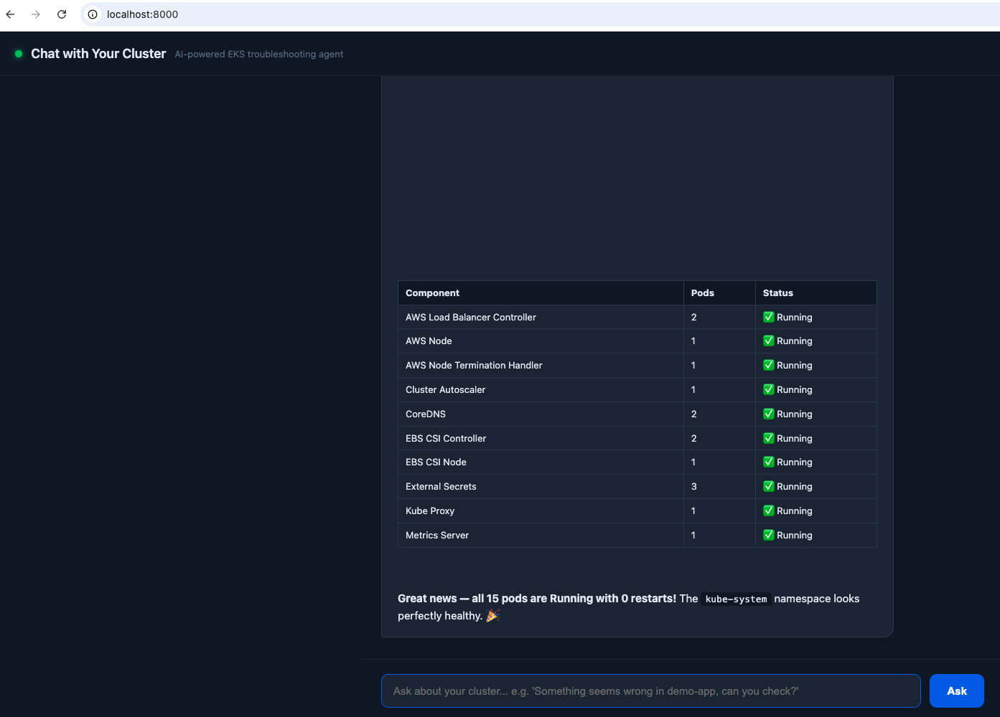

# Chat with Your Cluster

An AI-powered Kubernetes troubleshooting agent built on Amazon Bedrock. Ask a question in plain English — the agent reasons over live pod status, logs, and events from a real EKS cluster, chains together the diagnostic steps it needs, and explains the root cause and fix.

Built for and demoed at an AWS Community Talk: **"Chat with Your Cluster: Building an AI Troubleshooting Agent for Kubernetes."**



## Why

Traditional Kubernetes debugging means manually chaining `kubectl get pods`, `kubectl describe`, `kubectl logs`, and `kubectl get events`, then mentally correlating the output. This project replaces that manual grind with a conversational agent that does the same investigation — but decides its own next step based on what it finds, the way an experienced engineer would.

## How it works

```
Browser (index.html)
      |  POST /chat
      v
FastAPI server (server.py)  --- streams live progress via Server-Sent Events
      |
      v
Agent loop (bedrock_agent.py)
      |  \
      |   \--> Amazon Bedrock (Claude Sonnet 4.6) — reasons, decides next tool call
      |
      \--> k8s_tools.py --> EKS cluster (read-only) — get_pods, describe_pod, get_logs, get_events
```

The agent loop repeats as many times as the model decides it needs — chaining multiple tool calls (e.g. `get_pods` → `describe_pod` → `get_logs` → `get_events`) until it has enough signal to explain the root cause. It is **read-only by design**: no tool can create, modify, or delete anything in the cluster.

## Features

- **Conversational diagnosis** — ask questions like *"Something seems wrong in demo-app, can you check?"* instead of running commands manually
- **Agentic tool-use loop** — the model decides which Kubernetes checks to run and in what order, via Amazon Bedrock's Converse API
- **Live streaming UI** — a web interface shows each tool call as it happens, not just the final answer
- **Three demo failure scenarios** — CrashLoopBackOff, ImagePullBackOff, and OOMKilled, switchable with one script for live demos
- **Safe by construction** — every tool is read-only; the agent can diagnose production without any risk of making things worse

## Tech stack

- **Amazon Bedrock** (Claude Sonnet 4.6, cross-region inference) — agent reasoning
- **Amazon EKS** — target Kubernetes cluster
- **Python** — `boto3`, `kubernetes` client, FastAPI
- **FastAPI + Server-Sent Events** — streaming backend
- **Vanilla HTML/CSS/JS** — no frontend framework, kept intentionally simple

## Project structure

```
chat-with-your-cluster/
├── k8s_tools.py          # Read-only Kubernetes diagnostic functions (the agent's "hands")
├── bedrock_agent.py       # Bedrock tool-use agent loop (the agent's "brain")
├── server.py               # FastAPI backend, streams agent events over SSE
├── static/
│   └── index.html          # Chat UI with live tool-call visualization
├── demo-manifests/
│   ├── namespace.yaml
│   ├── scenario-crashloop.yaml
│   ├── scenario-imagepull.yaml
│   ├── scenario-oom.yaml
│   └── switch_scenario.sh   # Switches the live demo pod between failure scenarios
└── requirements.txt
```

## Prerequisites

- An EKS cluster you have `kubectl` access to
- AWS credentials with Bedrock (`bedrock:InvokeModel`, `bedrock:Converse`) and EKS read permissions
- Model access enabled for an Anthropic model on Amazon Bedrock in your account/region
- Python 3.9+

## Setup

```bash
git clone https://github.com/engr-usman/aws-aiops-demo-repo/tree/main/chat-with-your-cluster.git
cd chat-with-your-cluster

python3 -m venv venv
source venv/bin/activate

pip install -r requirements.txt
```

Confirm cluster access:

```bash
kubectl config current-context
kubectl get pods -A
```

Deploy the demo namespace and pick a failure scenario:

```bash
cd demo-manifests
kubectl apply -f namespace.yaml
chmod +x switch_scenario.sh
./switch_scenario.sh crashloop   # or: imagepull | oom
cd ..
```

## Usage

### CLI

```bash
python bedrock_agent.py
```

### Web UI

```bash
uvicorn server:app --reload --port 8000
```

Open `http://localhost:8000` and ask something like:

```
Something seems wrong in the demo-app namespace, can you check?
```

## Demo scenarios

| Scenario | Command | Failure type |
|---|---|---|
| Database connection failure | `./switch_scenario.sh crashloop` | CrashLoopBackOff |
| Missing container image | `./switch_scenario.sh imagepull` | ImagePullBackOff |
| Memory limit exceeded | `./switch_scenario.sh oom` | OOMKilled |

## Roadmap

- Auto-remediation for safe, pre-approved actions
- Slack ChatOps integration
- Multi-cluster support

## Author

**Usman Ahmad** — HOD DevOps
[GitHub](https://github.com/engr-usman) · [Portfolio](https://syedusmanahmad.com)

## License

MIT